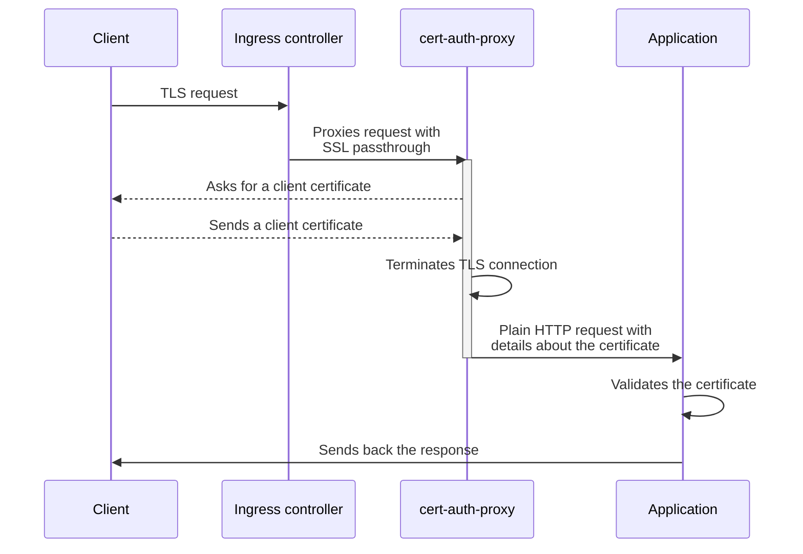

# cert-auth-proxy

`cert-auth-proxy` is a small utility intended to be used as a sidecar of any Kubernetes pod, allowing for supporting
client certificate authentication without relying on the cluster's ingress controller.
It relies on SSL passtrough and is typically used as a sidecar of the app not supporting TLS authentication directly.



## Prerequisites

To install `cert-auth-proxy`, you first need to address the following:

- Issue TLS certificates for all domains you want to proxy. This is required because `cert-auth-proxy` will terminate
  TLS connections and forward them to the upstream app in HTTP.
- Make sure that your ingress controller and security policies allow for SSL passthrough. Most ingress controllers
  support this, but it is not always enabled by default.

## Installation

The `cert-auth-proxy` container can be installed as a sidecar alongside any application. In a Kubernetes pod, it should
look like this:

```yaml
containers:
  - ...
  - name: cert-auth-proxy
    image: registry.evertrust.io/cert-auth-proxy:latest
    imagePullPolicy: Never
    ports:
      - name: https-proxy
        # By default, cert-auth-proxy listens on port 443.
        containerPort: 8443
    env:
      - name: UPSTREAM
        # This is the local address of the service.
        value: localhost:9000
    volumeMounts:
      - name: example-org-tls
        mountPath: /var/cert-auth-proxy/certificates/example.org
...
volumes:
  - name: example-org-tls
    secret:
      secretName: example-org-tls
```

## Configuration

`cert-auth-proxy` is configured through environment variables. Although only the `UPSTREAM` variable is required, the
following configuration options are available:

| Variable                | Description                                                                                    | Default value                 |
|-------------------------|------------------------------------------------------------------------------------------------|-------------------------------|
| `UPSTREAM`              | Upstream server to forward requests to                                                         |                               |
| `FORWARDED_HEADER_NAME` | Name of the header in which the base64-encoded certificate will be sent to the upstream.       | `X-Forwarded-Tls-Client-Cert` |
| `SSL_VERIFY_CLIENT`     | Name of the client certificate verification mode. Can be `on`, `optional`, or `optional_no_ca` | `optional_no_ca`              |

If you wish to force the clients to use specific CAs only, you can mount them into the container in
the `/var/cert-auth-proxy/trusted-cas/<name>/ca.crt` and set the `SSL_VERIFY_CLIENT` variable to `on`.

## Troubleshooting

The most common issue is that the nginx reverse proxy does not have a valid certificate for the requested host :

- On the client side, this error will mostly trigger a `TLSV1_ALERT_INTERNAL_ERROR` error
- On the server side, you'll seed a log stating something
  like `cannot load certificate "/var/cert-auth-proxy/certificates/<unsupported host>/tls.crt"`

To fix this, ensure that ingress objects are configured only for domains for which you have a valid certificate mounted
into the pod.